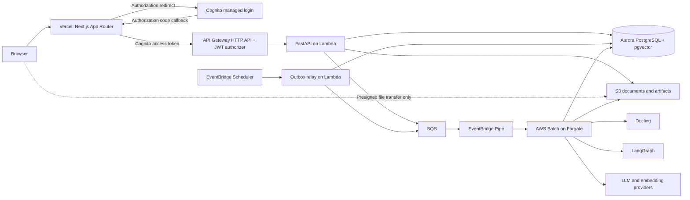
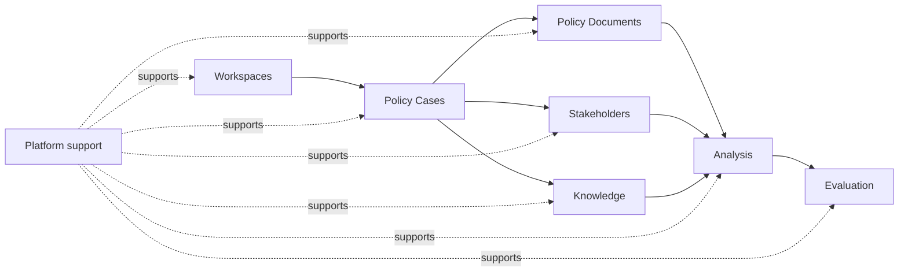

# POLARIS Architecture

> **Status:** Accepted  
> **Scope:** credible portfolio deployment  
> **Last updated:** 2026-08-04

POLARIS is a Domain-Driven Design and CQRS modular monolith. It runs locally without cloud infrastructure and deploys across Vercel and AWS using serverless and ephemeral compute.

This architecture is intentionally sized for a single-developer portfolio project. Once its required controls are implemented and verified, the deployment is intended for an invited, low-traffic demonstration using public, synthetic, or ordinary low-sensitivity internal content. Personal data is limited to the minimum invited-account identity required for access and public professional information used as evidence. It is not an enterprise platform and is not approved for classified, legally privileged, credential-bearing, special-category, non-public personal, or otherwise high-impact sensitive content.

## 1. Architecture Summary

| Area                 | Decision                                      |
| -------------------- | --------------------------------------------- |
| Architecture         | Modular monolith                              |
| Backend              | Python 3.14.6, FastAPI                        |
| Frontend             | TypeScript, Next.js App Router on Vercel      |
| API hosting          | API Gateway HTTP API and AWS Lambda           |
| Background compute   | AWS Batch on Fargate                          |
| Database             | PostgreSQL with pgvector                      |
| Document storage     | Local filesystem or Amazon S3                 |
| Document processing  | Docling                                       |
| AI orchestration     | LangGraph and LangChain                       |
| Authentication       | Auth.js sessions with Amazon Cognito identity |
| Infrastructure       | AWS Terraform and Vercel Git integration      |
| Local infrastructure | Docker Compose                                |
| API contract         | OpenAPI generated by FastAPI                  |

POLARIS uses three primary application runtimes:

- **Web runtime:** Next.js on Vercel for presentation, Auth.js sessions, and the backend-for-frontend.
- **API runtime:** lightweight FastAPI image for synchronous commands and queries.
- **Worker runtime:** heavyweight Python image for Docling, embeddings, LangGraph workflows, simulations, and evaluations.

A scheduled outbox-relay invocation reuses the lightweight API image with a dedicated entry point. It is not a fourth application codebase or independently evolving service.

The API and worker runtimes are built from the same Python application. They share bounded contexts, domain code, application code, database, versioning, and release lifecycle. The web runtime is a presentation boundary and does not contain the Python domain or application layers.

## 2. Goals

- Strict Domain-Driven Design.
- Logical CQRS with separate command and query paths.
- Strong static typing across Python and TypeScript.
- Complete OpenAPI documentation.
- Local development without cloud infrastructure.
- Low AWS idle cost.
- Ephemeral compute for document and LLM workloads.
- Reproducible analysis runs.
- Maintainability by one developer.
- Moderate horizontal scalability without architectural distribution.
- A small, defensible production deployment that demonstrates sound engineering without enterprise operations.

## 3. Non-Goals

The initial architecture excludes:

- microservices;
- Kubernetes;
- Kafka;
- Redis;
- Celery;
- event sourcing;
- separate command and query databases;
- a dedicated vector database;
- Step Functions for LangGraph workflows;
- always-running worker services;
- Next.js domain or business API routes;
- LocalStack;
- enterprise-grade tenant isolation and fine-grained RBAC;
- public self-registration;
- mandatory staging infrastructure;
- multi-region recovery or a contractual SLA;
- formal certification against a security or compliance framework;
- classified, legally privileged, credential-bearing, special-category, non-public personal, or high-impact sensitive application content;
- mandatory malware scanning for uploads from invited users.

## 4. System Context



## 5. Runtime Topology

### 5.1 Web

The web runtime is a Next.js App Router application deployed from `apps/web` through Vercel Git integration. It is an authenticated presentation backend-for-frontend, not a business application backend.

Responsibilities:

- user interface;
- Auth.js login, callback, logout, encrypted session, and Cognito token renewal;
- React Server Components and request-time rendering;
- thin presentation-specific Route Handlers and Server Actions;
- generated OpenAPI client;
- presentation-specific aggregation and client-state hydration;
- TanStack Query for interactive client-side server state;
- command submission;
- query rendering;
- analysis progress polling or streaming.

Auth.js owns `/api/auth/*`. Explicit presentation adapters use `/api/bff/*`. FastAPI retains the authoritative `/api/v1/*` resource API.

All browser-initiated authenticated control-plane requests pass through the BFF. Server Components use the same server-only authenticated FastAPI client. The BFF:

- reads the Auth.js session on the server;
- attaches the server-held Cognito access token;
- rebuilds upstream headers from a positive allowlist and discards caller-supplied authorization, identity, cookie, host, forwarding, hop-by-hop, and AWS request-context headers;
- uses explicit upstream route allowlists and request-size limits;
- preserves status codes, `application/problem+json`, `ETag`, `If-Match`, `Idempotency-Key`, retry metadata, and correlation identifiers through a response-header allowlist that never relays upstream cookies or hop-by-hop headers.

The BFF must not be an unrestricted catch-all proxy. Next.js Route Handlers and Server Actions must not implement domain commands, authoritative authorization, persistence, job dispatch, or business rules.

Auth.js applies its own CSRF protections to `/api/auth/*`. State-changing `/api/bff/*` Route Handlers independently require an application CSRF token and validated `Origin` and `Host` values. Server Actions retain Next.js same-origin `Origin` and `Host` enforcement and bounded request bodies, authenticate the session at entry, and are treated as public endpoints rather than trusted internal calls.

Protected user and workspace data is dynamic and must not use a shared cache. `proxy.ts` may perform optimistic cookie-based redirects but is not an authorization boundary. Client Components are limited to interactive portions of a page.

The normal direct browser-to-AWS exception is a presigned S3 upload or download issued through an authenticated FastAPI use case. Browser code does not receive Cognito access or refresh tokens.

### 5.2 API

The API runtime contains:

- FastAPI;
- command and query buses;
- application handlers;
- domain model;
- PostgreSQL adapters;
- S3 adapters;
- SQS adapters;
- authentication and authorization;
- OpenAPI generation.

The API accepts Cognito access tokens forwarded by the BFF. API Gateway's JWT authorizer performs cryptographic signature, issuer, expiry, app-client or audience, and route-scope validation before Lambda invocation. AWS Lambda Web Adapter serializes the API Gateway request context into its `x-amzn-request-context` header, replacing any caller value. A FastAPI authentication adapter parses the expected HTTP API v2 authorizer structure, fails closed when it is absent or malformed, requires an access token with the expected `token_use`, derives the durable actor identifier from Cognito `sub`, and performs authoritative workspace and domain authorization for every use case. Caller-supplied identity headers are never trusted.

The Lambda resource policy grants `apigateway.amazonaws.com` invocation only from the configured API execution ARN. Normal human, application-runtime, CI, and deployment roles receive no direct `lambda:InvokeFunction` permission on the API function. This IAM restriction is part of the trust boundary: authorizer context is not independently cryptographic after it reaches Lambda, so a same-account principal with direct invocation permission could forge an API Gateway-shaped event.

The Lambda image excludes Docling, OCR, PyTorch, and heavyweight model dependencies.

The same ASGI application runs locally with Uvicorn and on Lambda through AWS Lambda Web Adapter. The adapter release is pinned rather than using a floating tag, and a deployed integration test verifies the expected authorizer-context header shape and caller-header replacement before an upgrade is accepted.

### 5.3 Worker

The worker runtime contains:

- shared domain and application code;
- background job runner;
- Docling;
- OCR dependencies;
- LangGraph and LangChain;
- embedding clients;
- LLM clients;
- evaluation tooling.

Each AWS Batch task handles one background job and terminates when the job completes or reaches a human-review checkpoint.

### 5.4 Outbox Relay

Commands that require asynchronous work write a background job and outbox record in the same database transaction.

After commit:

1. the API attempts immediate SQS publication;
2. a scheduled relay republishes pending outbox records;
3. successful records are marked as published.

EventBridge Scheduler invokes a dedicated relay entry point in the lightweight application image every five minutes. One relay invocation at a time claims a bounded batch of pending rows with database locking, publishes them idempotently, and records attempts and terminal failures. The relay contains dispatch mechanics but no domain rules.

## 6. Bounded Contexts



### 6.1 Workspaces

Owns:

- `Workspace`;
- membership;
- workspace preferences;
- model configuration;
- owner, member, and read-only roles.

### 6.2 Policy Cases

Owns:

- `PolicyCase`;
- policy problem;
- objectives;
- assumptions;
- constraints;
- policy options;
- intervention logic;
- monitoring indicators.

`PolicyCase` is the principal aggregate.

### 6.3 Knowledge

Owns:

- `SourceDocument`;
- source versions;
- ingestion state;
- document structure;
- chunks;
- claims;
- citations;
- evidence assessments;
- evidence snapshots;
- evidence retrieval.

Evidence sources are immutable after ingestion. Corrections create new source versions.

### 6.4 Stakeholders

Owns:

- `Stakeholder`;
- `StakeholderProfile`;
- organisational mandate;
- observed positions;
- inferred positions;
- relationships;
- evidence links;
- profile versions.

### 6.5 Policy Documents

Owns:

- `PolicyDocument`;
- document versions;
- sections;
- clauses;
- definitions;
- policy mechanisms;
- change sets.

Policy drafts are versioned mutable artifacts. Published versions are immutable.

### 6.6 Analysis

Owns:

- analysis scenarios;
- consultation rehearsals;
- analysis runs;
- stakeholder reviews;
- issues;
- confidence assessments;
- consultation questions;
- syntheses;
- human approvals.

Every analysis run references immutable versions of:

- policy document;
- evidence snapshot;
- stakeholder profiles;
- prompts;
- model configuration.

### 6.7 Evaluation

Owns:

- benchmark datasets;
- expected issues;
- evaluation runs;
- metric definitions;
- metric results;
- model comparisons.

### 6.8 Shared Technical Support

Shared technical support is an architectural category, not a domain bounded context or a top-level `platform` package. It includes technical records and adapters used through narrow application ports:

- background jobs;
- transactional outbox;
- idempotency records;
- prompt versions;
- model invocation records;
- audit events;
- blob references.

Context-neutral implementations belong in `runtime/infrastructure`; implementations of context-owned ports belong in that context's `adapters` package. Domain-significant concepts, including analysis provenance, remain in the owning bounded context. Technical support types must not contain policy-domain rules, and domain or application packages must not import concrete adapters.

## 7. Internal Module Architecture

The Python package separates business capabilities from the executable application shell:

- `contexts/` contains only named bounded contexts and makes the domain visible;
- `runtime/config.py` defines typed settings but does not construct services;
- `runtime/bootstrap/` is the composition root that assembles processes and owns lifecycle wiring;
- `runtime/entrypoints/` contains API, worker, and CLI driving adapters;
- `runtime/infrastructure/` contains context-neutral technical foundations;
- `main.py` is a minimal process import target and contains no application wiring.

Do not create `shared/` until at least two contexts require one domain concept with identical meaning and invariants. Such a concept belongs in `shared/domain/`; general utilities, transport models, configuration, and infrastructure do not.

Each bounded context grows the following structure only as real behavior requires it:

```text
contexts/<context>/
├── domain/
│   ├── <domain-concept>.py
│   ├── <domain-event>.py
│   ├── <domain-error>.py
│   └── <repository-interface>.py
├── application/
│   ├── commands/
│   ├── queries/
│   ├── read_models/
│   └── ports/
└── adapters/
    ├── persistence/
    └── services/
```

Each module has one primary public concept, and its filename is that concept converted to `snake_case`. Directories group related concepts; generic collection modules such as `schemas.py`, `models.py`, `entities.py`, `dto.py`, `handlers.py`, `utils.py`, `events.py`, `errors.py`, `repositories.py`, `ports.py`, and `services.py` are prohibited. Conventional composition and package files such as `__init__.py`, `main.py`, `config.py`, `api_router.py`, and `conftest.py` are allowed when their responsibility is singular and clear.

FastAPI routers, authentication extraction, Pydantic transport models, HTTP error mappings, and operational endpoints belong under `runtime/entrypoints/api/`. Liveness belongs under `runtime/entrypoints/api/system/health/`, with `HealthResponse` in `health_response.py` and its router in `health_router.py`; it is a transport concern and does not require an artificial command, query, or domain model.

Dependencies must follow:

```text
runtime/bootstrap -> runtime/entrypoints, runtime/infrastructure, context adapters
runtime/entrypoints -> context application
context adapters -> context application and domain
context application -> context domain
context domain -> optional shared domain
```

Rules:

- Domain code imports only the standard library, its own context, and an explicitly approved shared-domain concept.
- Domain objects do not inherit from Pydantic or SQLAlchemy models.
- Application handlers depend on protocols.
- Context adapters implement application and domain protocols.
- FastAPI routes call command or query buses.
- FastAPI routes do not import persistence adapters or concrete infrastructure.
- No context module imports `runtime`.
- `runtime/infrastructure` does not import bounded contexts.
- Only `runtime/bootstrap` selects and connects concrete adapters.
- LangGraph is a worker-side orchestration adapter; domain and application packages do not import LangGraph types.
- LangGraph nodes call application services through explicit ports.
- LangGraph nodes do not access repositories directly.
- A bounded context does not load another context's aggregates.
- Cross-context UI views use explicit read models.
- Architecture tests enforce import boundaries.

ADR-024 defines the canonical package and test layout, including the distinction between bounded contexts, runtime wiring, context adapters, and optional shared-domain concepts.

## 8. Domain Modelling Standards

Use:

- classes or dataclasses for entities and aggregates;
- frozen, slotted dataclasses for value objects;
- `NewType` or dedicated classes for identifiers;
- `Protocol` for ports;
- `StrEnum` for closed vocabularies;
- `Decimal` for exact numerical values;
- timezone-aware timestamps;
- explicit domain exceptions;
- immutable domain events;
- aggregate version numbers;
- optimistic concurrency control.

Use Pydantic for:

- API requests and responses;
- configuration;
- LLM structured outputs;
- background-job payloads.

Do not use Pydantic or SQLAlchemy models as domain entities.

## 9. CQRS

POLARIS uses logical CQRS within one application and one database.

### 9.1 Commands

Commands:

- express an intention;
- load aggregates;
- invoke domain behavior;
- persist through a unit of work;
- emit domain events;
- return an identifier, version, or acknowledgement.

Examples:

```text
CreatePolicyCase
UpdatePolicyProblem
AddPolicyObjective
RegisterStakeholder
CreateDocumentUpload
CompleteDocumentUpload
StartDocumentProcessing
StartConsultationRehearsal
ApproveStakeholderReview
RevisePolicyClause
```

Command handlers must not return page-specific read models.

### 9.2 Queries

Queries:

- never mutate state;
- do not hydrate aggregates;
- return immutable DTOs;
- use purpose-built SQL;
- may join read models across bounded contexts.

Examples:

```text
GetPolicyCaseWorkspace
SearchEvidence
GetStakeholderProfile
GetPolicyDocumentComparison
GetConsultationIssueMatrix
GetAnalysisRunProgress
```

### 9.3 Command and Query Buses

Command and query buses are implemented in the codebase without a mediator framework.

Bus middleware provides:

- transaction boundaries;
- authorization;
- idempotency;
- logging;
- tracing;
- timing;
- metrics.

The domain must not use a service locator.

## 10. Persistence

Use one PostgreSQL cluster with schemas:

```text
workspace
policy
knowledge
stakeholder
policy_document
analysis
evaluation
platform
read_model
```

### 10.1 Write Model

Write-side repositories persist aggregate state and use optimistic concurrency.

Each command executes in one transaction:

```text
begin
  -> load aggregate
  -> execute domain behavior
  -> capture domain events
  -> persist aggregate
  -> persist required outbox and audit records
  -> update synchronous projections
commit
```

### 10.2 Read Models

Use projection tables for query-heavy views:

```text
read_model.policy_case_dashboard
read_model.stakeholder_profile_summary
read_model.issue_matrix
read_model.analysis_run_progress
read_model.document_search
```

Update projections synchronously unless the source operation is already asynchronous.

### 10.3 Domain Events

Domain events communicate completed facts inside the modular monolith.

Examples:

```text
PolicyCaseCreated
PolicyObjectiveAdded
DocumentUploadCompleted
DocumentProcessingRequested
DocumentProcessed
StakeholderProfileVersionCreated
ConsultationRehearsalRequested
StakeholderReviewCompleted
PolicyClauseRevised
```

Domain events do not imply event sourcing. Current aggregate state remains the persistence model.

### 10.4 Transactional Outbox

Outbox records contain:

```text
id
event_type
aggregate_type
aggregate_id
aggregate_version
workspace_id
payload
correlation_id
causation_id
created_at
published_at
attempt_count
```

External messages contain identifiers and version references, not complete domain objects.

## 11. Background Jobs

Production flow:

```text
command
  -> background job and outbox record
  -> SQS
  -> EventBridge Pipe
  -> AWS Batch SubmitJob
  -> Fargate worker
  -> PostgreSQL and S3 updates
```

Use separate queues and job definitions for:

```text
polaris-document-processing
polaris-analysis
polaris-evaluation
```

Queues may share one Fargate compute environment.

EventBridge Pipes use a source batch size of one and submit one Batch job per queue message. Queue visibility timeouts, retries, dead-letter policies, Pipe concurrency, and Batch maximum vCPU are bounded in Terraform so a demonstration workload cannot create uncontrolled compute or database pressure.

### 11.1 Job Payload

```json
{
  "jobId": "0198...",
  "jobType": "PROCESS_DOCUMENT",
  "workspaceId": "0198...",
  "correlationId": "0198..."
}
```

Messages must not contain:

- document contents;
- policy drafts;
- stakeholder profiles;
- prompts;
- credentials;
- private evidence.

### 11.2 Delivery Semantics

Workers assume at-least-once delivery.

Idempotency uses:

- valid job-state transitions;
- processing leases;
- aggregate versions;
- content hashes;
- unique constraints;
- deterministic artifact keys;
- idempotency records.

A repeated job must return the previous result or safely resume.

## 12. Document Processing

Document ingestion flow:

```text
CreateDocumentUpload
  -> create presigned S3 POST policy
  -> upload source file
  -> CompleteDocumentUpload
  -> verify object metadata and mark pending validation
  -> enqueue processing job
  -> validate size, type, signature, hash, and resource limits
  -> Docling conversion
  -> canonical representation
  -> structural chunking
  -> embeddings
  -> PostgreSQL indexing
  -> evidence projections
```

### 12.1 Storage

S3 layout:

```text
workspaces/{workspace_id}/documents/{document_id}/
├── source/{version_id}/original
├── derived/{version_id}/docling.json
├── derived/{version_id}/document.md
└── derived/{version_id}/processing-report.json
```

PostgreSQL stores:

- document metadata;
- processing status;
- section structure;
- searchable text;
- chunks;
- embeddings;
- citations;
- S3 references.

Large source and derived files remain outside PostgreSQL.

Presigned uploads use short-lived S3 POST policies scoped to one workspace, document, version, object key, allowed content type, and a `content-length-range` maximum. Completion independently verifies actual object size, S3 metadata, and the content hash instead of trusting browser-supplied metadata. Uploaded objects remain private and unavailable for retrieval until validation succeeds. Source downloads use an allowlisted response type and `Content-Disposition: attachment`; active browser-content formats are unsupported.

The portfolio deployment accepts uploads only from invited users and does not operate a malware-scanning service. Unsupported, encrypted, malformed, oversized, or unexpectedly expensive files fail closed. Public or otherwise untrusted uploads require a new security review and a managed malware-scanning decision.

### 12.2 Deduplication

Every source version receives a SHA-256 content hash.

Identical content may reuse immutable processing artifacts. Domain associations remain separate.

### 12.3 Worker Image

The worker image includes required Docling models and OCR dependencies. Runtime jobs must not depend on downloading model assets.

## 13. Retrieval

Use PostgreSQL full-text search and pgvector.

Retrieval pipeline:

```text
query normalization
  -> metadata filters
  -> lexical retrieval
  -> vector retrieval
  -> reciprocal-rank fusion
  -> authority and recency weighting
  -> optional reranking
  -> citation construction
```

Required filters:

- workspace;
- stakeholder;
- jurisdiction;
- publication date;
- evidence cut-off;
- source type;
- authority;
- confidentiality;
- document version.

Persist the retrieval configuration:

```text
embedding_provider
embedding_model
embedding_dimension
embedding_created_at
chunking_strategy
chunking_strategy_version
```

Changing an embedding model creates a new embedding profile. Existing vectors are not overwritten.

## 14. LangGraph

LangGraph is an outer worker-side adapter that orchestrates application workflows. It does not own domain state, and the domain and application layers do not depend on LangGraph.

Graph state contains identifiers and transient workflow data. It must not contain:

- aggregates;
- database sessions;
- ORM entities;
- credentials.

Consultation workflow:

```text
load analysis scenario
  -> decompose policy document
  -> identify material issues
  -> retrieve stakeholder evidence
  -> generate independent review
  -> validate citations
  -> run evidence critic
  -> calibrate confidence
  -> persist review
  -> synthesize issue matrix
  -> audit missing voices
  -> request human approval
  -> generate consultation brief
```

### 14.1 Checkpoints and Human Review

LangGraph checkpoints are stored in PostgreSQL.

At a human-review interrupt:

1. persist the checkpoint;
2. mark the analysis run `WAITING_FOR_REVIEW`;
3. terminate the worker;
4. accept a review command through FastAPI;
5. enqueue a resume job;
6. resume from the checkpoint.

Workers must not remain active while awaiting human input.

### 14.2 Parallelism

A single analysis job initially processes stakeholder reviews with:

- `asyncio.TaskGroup`;
- bounded semaphores;
- provider rate limits;
- deterministic result ordering.

Per-stakeholder Batch fan-out requires measured need.

## 15. API and OpenAPI

FastAPI is the authoritative API contract.

Every endpoint defines:

- stable `operation_id`;
- summary and description;
- tags;
- typed request model;
- typed response model;
- status codes;
- expected error responses;
- authentication requirements;
- idempotency behavior;
- request and response examples where useful.

API paths use resource-oriented naming:

```text
/api/v1/policy-cases
/api/v1/stakeholders
/api/v1/evidence
/api/v1/policy-documents
/api/v1/analysis-runs
/api/v1/evaluations
```

`/api/v1/*` is the only public business API namespace. Auth.js owns `/api/auth/*`, and explicit presentation-facing BFF adapters use `/api/bff/*`; neither namespace changes the FastAPI resource contract. CQRS implementation details must not appear in URLs.

Conventions:

- `201 Created` for synchronously created resources;
- `202 Accepted` for background operations;
- `409 Conflict` for version conflicts;
- `422 Unprocessable Content` for semantic validation failures;
- `application/problem+json` for errors;
- `Idempotency-Key` for retryable commands;
- `If-Match` and `ETag` for optimistic concurrency.

Error contracts use RFC 9457 Problem Details. `runtime/entrypoints/api/errors/` owns the typed Pydantic problem schema and the mapping from transport, application, and domain exceptions to HTTP responses. Domain and application exceptions express business meaning and never contain HTTP status codes. Unexpected failures return a sanitized `500` problem response and retain diagnostic detail only in structured server logs. Validation and expected failure responses are documented in OpenAPI alongside successful responses.

Contract pipeline:

```text
FastAPI
  -> generate openapi.json
  -> lint contract
  -> detect breaking changes
  -> generate TypeScript client
  -> compile frontend
```

The OpenAPI document is generated and must not be edited manually.

The generated TypeScript client is usable from React Server Components, Route Handlers, and thin Server Actions. The BFF must preserve FastAPI response and concurrency semantics rather than translating them into a second application contract.

## 16. Frontend Architecture

Use:

- TypeScript strict mode;
- Next.js App Router deployed on Vercel;
- React Server Components by default and Client Components only for interactive regions;
- a pinned, supported stable Auth.js release with Cognito authorization-code authentication;
- encrypted JWT-cookie sessions with no session database;
- the generated OpenAPI client from server-only code;
- TanStack Query for interactive client-side server state;
- React Hook Form for forms;
- React Aria Components behind a small application-owned component layer for non-native interactive controls;
- dynamic request-time rendering and non-shared caching for protected data;
- `proxy.ts` only for optimistic redirects and session-presence checks.

The frontend must not:

- access PostgreSQL;
- duplicate domain validation;
- publish directly to SQS;
- invoke Batch;
- use S3 SDKs or AWS credentials;
- call LLM providers;
- implement business commands or authoritative authorization in Next.js Route Handlers or Server Actions;
- expose Cognito access or refresh tokens to browser JavaScript;
- provide an unrestricted generic proxy to FastAPI.

Frontend validation improves usability. FastAPI and the domain remain authoritative. Browser code may use short-lived presigned S3 URLs returned through the authenticated control plane, but it does not call AWS control-plane APIs.

The application-owned UI layer contains only components required by implemented journeys. It uses neutral POLARIS tokens and styling, and refers to established government-service patterns for clarity and usability without adopting another government's branding or copying a complete design system.

## 17. Local Development

Local development requires no AWS account or AWS emulator.

```text
Host processes:
  Next.js development server
  FastAPI with Uvicorn
  POLARIS worker

Docker Compose:
  PostgreSQL with pgvector
  optional Ollama
```

Environment adapters:

| Port           | Local                                                             | Deployed                                            |
| -------------- | ----------------------------------------------------------------- | --------------------------------------------------- |
| Blob storage   | Filesystem                                                        | S3                                                  |
| Job dispatch   | PostgreSQL queue                                                  | SQS                                                 |
| Job execution  | Local worker                                                      | AWS Batch                                           |
| Authentication | Auth.js development identity and FastAPI development-auth adapter | Auth.js with Cognito                                |
| Database       | PostgreSQL container                                              | Aurora PostgreSQL                                   |
| Secrets        | `.env`                                                            | Vercel sensitive variables, Secrets Manager, or IAM |
| LLM            | Ollama or provider API                                            | Bedrock or external provider                        |

The local Auth.js development identity provider and the FastAPI development-auth adapter use an explicit local-only configuration. Both must fail closed and be unavailable in preview and production. Local development requires neither Cognito nor Vercel. The local worker and AWS Batch invoke the same `JobRunner`.

CLI commands:

```text
polaris worker
polaris run-job --job-id <uuid>
polaris migrate
polaris seed-demo
polaris export-openapi
```

Repository commands:

```text
make bootstrap
make dev
make test
make lint
make typecheck
make architecture-test
make openapi
make seed-demo
```

Docling model files use a persistent local cache.

## 18. Repository Structure

```text
polaris/
├── apps/
│   ├── api/
│   │   ├── src/polaris/
│   │   │   ├── main.py
│   │   │   ├── contexts/
│   │   │   │   ├── workspaces/
│   │   │   │   ├── policy_cases/
│   │   │   │   ├── knowledge/
│   │   │   │   ├── stakeholders/
│   │   │   │   ├── policy_documents/
│   │   │   │   ├── analysis/
│   │   │   │   └── evaluation/
│   │   │   └── runtime/
│   │   │       ├── config.py
│   │   │       ├── bootstrap/
│   │   │       │   ├── api.py
│   │   │       │   └── worker.py
│   │   │       ├── entrypoints/
│   │   │       │   ├── api/
│   │   │       │   ├── worker/
│   │   │       │   └── cli/
│   │   │       └── infrastructure/
│   │   ├── tests/
│   │   │   ├── unit/
│   │   │   ├── contract/api/
│   │   │   ├── integration/
│   │   │   ├── end_to_end/
│   │   │   └── architecture/
│   │   └── pyproject.toml
│   └── web/
│       ├── src/
│       ├── tests/
│       └── package.json
├── packages/
│   ├── api-client/
│   └── ui/
├── contracts/
│   └── openapi.json
├── datasets/
│   └── oecd-amount-b/
├── prompts/
├── docker/
│   ├── Dockerfile.api
│   └── Dockerfile.worker
├── infrastructure/
│   └── terraform/
├── architecture/
│   ├── adr/
│   └── ARCHITECTURE.md
├── compose.yaml
├── Makefile
├── package.json
├── turbo.json
└── README.md
```

Python dependency groups:

```text
core
api
worker
development
evaluation
```

Container images:

```text
polaris-api
  core + api

polaris-worker
  core + worker + Docling + LangGraph
```

## 19. Python Standards

Baseline tooling:

```text
Python 3.14.6
uv
Ruff
Pyright strict
pytest
pytest-asyncio
Hypothesis
SQLAlchemy 2
Alembic
Pydantic 2
psycopg 3
structlog
```

Requirements:

- no untyped public functions;
- no untyped mappings across application boundaries;
- no unexplained `Any`;
- immutable command and query DTOs;
- protocols for external dependencies;
- constructor injection;
- structured concurrency;
- bounded parallelism;
- property-based tests for value objects and invariants;
- architecture tests for dependency boundaries.

Use `asyncio.TaskGroup` instead of unmanaged background tasks.

Use `contextvars` for:

- correlation ID;
- causation ID;
- workspace ID;
- actor ID;
- job ID;
- analysis-run ID.

## 20. Deployment

| Concern                    | Platform or service                                      |
| -------------------------- | -------------------------------------------------------- |
| Web runtime                | Vercel Next.js runtime                                   |
| Web delivery               | Vercel Git integration, CDN, and Functions               |
| Authentication             | Auth.js with Cognito User Pool                           |
| HTTP API                   | API Gateway HTTP API                                     |
| API authentication         | API Gateway JWT authorizer and FastAPI authorization     |
| Synchronous backend        | AWS Lambda container                                     |
| Relational and vector data | Aurora PostgreSQL with pgvector                          |
| Documents and artifacts    | Amazon S3                                                |
| Job queue                  | Amazon SQS                                               |
| Queue-to-job integration   | EventBridge Pipes                                        |
| Outbox recovery relay      | EventBridge Scheduler and Lambda                         |
| Background compute         | AWS Batch on Fargate                                     |
| Container registry         | Amazon ECR                                               |
| Secrets                    | Vercel sensitive variables, Secrets Manager, and IAM     |
| Logs and metrics           | Vercel observability and CloudWatch                      |
| Infrastructure             | AWS Terraform and source-controlled Vercel configuration |

### 20.1 Web Deployment

Vercel Git integration builds `apps/web` with Turborepo and creates protected previews and one production deployment. Production uses a stable custom domain and one Cognito app client. Pull-request previews receive no production secrets, are not registered as Cognito callbacks, and are limited to build, static-page, and unauthenticated presentation checks. An independently authenticated staging environment is added only when a real external pilot or release cadence justifies it.

Vercel Functions run in a region close to the selected AWS API region. The web runtime reaches FastAPI through public API Gateway; it does not join the VPC or connect to Aurora, SQS, Batch, S3 SDKs, or model providers.

### 20.2 Database Connectivity

The API Lambda connects to Aurora inside the VPC using:

- TLS;
- IAM database authentication;
- a dedicated database role;
- `NullPool` or a small connection pool;
- reserved concurrency.

Batch workers use a small bounded connection pool.

Database migrations run as a deployment-only AWS Batch job in the same VPC. The job reuses the lightweight API image with a migration entry point, assumes a dedicated migration IAM and database role, is submitted directly by the AWS deployment pipeline, and is never reachable through the product SQS queues or EventBridge Pipes.

RDS Proxy requires measured connection pressure.

### 20.3 Network

Use:

- private database subnets;
- VPC-attached Lambda subnets;
- public subnets for ephemeral Fargate jobs;
- no inbound rules for worker security groups;
- S3 gateway endpoint;
- SQS interface endpoint;
- no NAT Gateway.

Workers may receive public IPs for outbound access to model providers and AWS public endpoints. They expose no inbound service.

### 20.4 Cost Controls

The deployment avoids:

- running ECS services;
- load balancers;
- NAT Gateways;
- Kubernetes;
- Redis;
- separate vector infrastructure;
- idle worker containers.

Aurora is the primary fixed-cost component. LLM usage is expected to be the primary variable cost.

## 21. Terraform

```text
infrastructure/terraform/
├── bootstrap/
│   ├── state-bucket.tf
│   └── providers.tf
├── modules/
│   ├── network/
│   ├── database/
│   ├── storage/
│   ├── authentication/
│   ├── api/
│   ├── batch/
│   ├── queues/
│   └── observability/
└── environments/
    └── production/
        ├── main.tf
        ├── variables.tf
        └── outputs.tf
```

Initial infrastructure rules:

- one production AWS environment;
- S3 remote state with versioning and lockfiles;
- GitHub Actions OIDC;
- immutable ECR image digests;
- no Terraform provisioners;
- no Docker builds from Terraform;
- no Alembic execution through `local-exec`;
- no Terragrunt;
- no Terraform workspaces;
- no per-developer cloud environments.

AWS Terraform manages Cognito app clients, callback and logout URLs, API resources, and the remaining AWS infrastructure. Vercel is not managed by Terraform: Git integration owns web deployments and source-controlled project configuration. The Auth.js secret, Cognito issuer, client ID, client secret, and server-only FastAPI base URL are Vercel sensitive environment variables and must not use the `NEXT_PUBLIC_` prefix.

Preview deployments do not receive production Cognito, Auth.js, or FastAPI secrets. A second cloud environment is deliberately deferred until an external pilot needs isolated acceptance testing.

Database migrations run as an explicit deployment job. Schema changes follow the expand-and-contract pattern.

## 22. Security

Required controls:

- private S3 buckets;
- encryption at rest;
- TLS in transit;
- private Aurora subnets;
- IAM database authentication;
- least-privilege Lambda and Batch roles;
- a `Secure`, `HttpOnly`, `SameSite=Lax` Auth.js session cookie;
- Cognito authorization-code authentication with a confidential app client;
- Cognito self-registration disabled and production accounts created by invitation;
- Cognito-managed TOTP MFA required for production users;
- Cognito access and refresh tokens available only to Auth.js server code through the encrypted `HttpOnly` session cookie and never exposed to browser JavaScript;
- Auth.js CSRF protection for authentication routes, application CSRF tokens with `Origin` and `Host` validation for state-changing BFF Route Handlers, and Next.js same-origin enforcement plus entry-point authentication for Server Actions;
- positive BFF upstream-header allowlists that remove caller-supplied authorization, identity, cookie, host, forwarding, hop-by-hop, and AWS request-context headers;
- API Gateway JWT-authorizer verification of signature, issuer, expiry, app client or audience, and required route scopes;
- FastAPI rejection of missing or malformed authorizer context and validation of `token_use` before accepting the actor identity;
- Cognito `sub` as the durable actor identifier;
- authoritative workspace membership and authorization in FastAPI and PostgreSQL;
- a maintainer provisioning runbook that creates the Cognito invitation through a narrowly privileged AWS operator role and grants workspace membership separately through FastAPI;
- a maintainer deprovisioning runbook that removes workspace memberships through FastAPI, then uses a narrowly privileged AWS operator role through the console or operator CLI to disable the Cognito account and perform administrative global sign-out;
- 15-minute Cognito access tokens, an eight-hour Auth.js session and refresh-token lifetime, Cognito refresh-token rotation, and the maximum retry grace period;
- no distributed refresh lock or session database; concurrent refresh failure may require reauthentication;
- forced reauthentication when token renewal fails or a refresh race cannot be resolved;
- logout that removes the Auth.js cookie, revokes Cognito refresh state, and visits Cognito's logout endpoint;
- presigned direct uploads using S3 POST policies with `content-length-range` enforcement;
- short upload expiry plus content length, type, file-signature, hash, and processing-resource validation;
- allowlisted source-download content types and forced attachment disposition;
- workspace scope on every repository and query;
- dynamic, non-shared caching for authenticated user and workspace data;
- secrets outside source control;
- a restrictive Content Security Policy and standard browser security headers;
- bounded BFF request sizes and API Gateway throttling;
- dependency, secret, and container-image scanning in CI or managed hosting services;
- no Auth.js session data, Cognito tokens, or authorization headers in logs;
- no raw documents in application logs;
- no prompts or retrieved evidence in telemetry by default.

Publish a short privacy notice before inviting non-maintainer users. It identifies the minimal account data collected, its purpose, the Vercel, AWS Cognito, and approved model-provider processing paths, the retention boundary, and the contact for access or deletion requests.

Every workspace-owned aggregate, projection, job, and artifact reference includes `workspace_id`.

Workspace isolation is enforced by FastAPI authorization, workspace-scoped application and repository interfaces, tenant-scoped uniqueness and foreign-key constraints where practical, and negative cross-workspace integration tests. PostgreSQL row-level security, a WAF, a session database, and enterprise policy engines are outside this deployment.

The deployed POC accepts public, synthetic, or ordinary low-sensitivity internal content only. Personal data is limited to Cognito `sub`, email address, display name, workspace membership, and public professional information used as evidence. Private correspondence, personal contact datasets, credentials, special-category or criminal-offence data, and other high-impact sensitive material must be rejected or clearly prohibited.

Before accepting non-demo user data, provide an owner-authorized workspace-deletion operation. It removes active access to PostgreSQL and S3 data, derived artifacts, indexes, embeddings, and checkpoints; noncurrent S3 versions and encrypted database backups expire within the documented 14-day retention window.

## 23. Observability

Use structured JSON logs.

Include the following context when it is relevant to the event; do not populate empty fields merely to satisfy a schema:

```text
timestamp
level
service
runtime (`web`, `bff`, `api`, `worker`, or `outbox-relay`)
correlation_id
causation_id
workspace_id
actor_id
command_name
query_name
job_id
analysis_run_id
model
prompt_version
duration_ms
```

Initial actionable alarms:

- Auth.js callback failures;
- Cognito access-token refresh failures;
- BFF latency, errors, and upstream FastAPI failures;
- Lambda errors and throttles;
- SQS dead-letter queue depth;
- Batch failures;
- jobs stuck in `RUNNING`;
- Aurora connection failures;
- document-processing failures;
- LLM provider failures;
- outbox backlog older than ten minutes.

Application metrics:

- login, callback, logout, and token-refresh outcomes;
- BFF request duration and upstream status;
- command and query duration;
- document-processing duration;
- chunks per document;
- retrieval latency;
- model token usage;
- estimated model cost;
- unsupported-claim rate;
- citation-validation failure rate.

Policy actions use a domain audit log. CloudWatch is not the policy audit trail.

Vercel forwards the correlation identifier to FastAPI, which preserves it through commands, queries, outbox messages, and background jobs. If the browser supplies a correlation identifier, the BFF validates its format before forwarding it.

## 24. Testing

Required test layers:

- domain unit tests;
- property-based tests for high-value invariants;
- application-handler tests with in-memory fakes;
- PostgreSQL repository integration tests;
- FastAPI contract tests;
- OpenAPI schema tests;
- architecture dependency tests;
- Docling fixture tests;
- LangGraph node tests;
- workflow integration tests with model stubs;
- end-to-end tests against the local stack;
- benchmark and evaluation tests.

Authentication and BFF coverage includes:

- Auth.js login, callback, and logout;
- missing, expired, and malformed Auth.js sessions, plus revoked Cognito refresh state at token renewal;
- Cognito access-token renewal, concurrent refresh handling, and forced reauthentication;
- API Gateway rejection of invalid Cognito issuer, signature, app client or audience, expiry, and scope;
- FastAPI rejection of missing authorizer context, non-access tokens, and invalid actor claims;
- rejection of malformed authorizer context in FastAPI unit and adapter tests, caller-header spoofing through API Gateway, and IAM denial of direct API-function invocation by normal human, runtime, CI, and deployment roles;
- BFF Route Handler CSRF-token and invalid-`Origin` or `Host` rejection, plus Server Action cross-origin and missing-session rejection;
- stripping caller-supplied authorization, identity, cookie, host, forwarding, hop-by-hop, and AWS request-context headers;
- cross-workspace denial by FastAPI;
- authenticated cache isolation;
- preservation of problem details, status codes, optimistic-concurrency headers, idempotency headers, retry metadata, and correlation identifiers;
- presigned S3 POST policy creation through the BFF, `content-length-range` enforcement, and direct browser-to-S3 transfer;
- rejection of development identity in preview and production;
- invite-only sign-in and required production MFA;
- immediate denial after membership removal and verification that Cognito administrative permissions exist only in the operator runbook role;
- authenticated upload metadata verification and fail-closed document validation;
- safe source-download content type and attachment disposition.

LLM-dependent tests must use recorded or deterministic test doubles by default. Live-model tests run separately and require explicit credentials.

## 25. Deployment Pipeline

Shared continuous integration validates formatting, Python and TypeScript types, unit and integration tests, architecture tests, the generated OpenAPI contract, and generated-client compatibility. CI fails when the checked-in contract differs from FastAPI output or when the TypeScript client cannot be regenerated and compiled against it.

CI also verifies the pinned Auth.js release against the selected Next.js major. Production must not use a beta, release-candidate, or other prerelease authentication package without an explicit architecture and security review.

CI also runs repository secret scanning, dependency vulnerability checks, and container-image scanning. A known critical vulnerability in a deployed dependency or image blocks release unless a documented, time-bounded exception establishes that it is not exploitable in POLARIS.

Vercel Git integration owns the web pipeline:

```text
Git change
  -> Turborepo filtered build for apps/web and dependencies
  -> generate client from versioned OpenAPI contract
  -> type-check and build Next.js
  -> protected preview or production deployment
  -> unauthenticated preview checks or authenticated production smoke tests
```

Vercel and AWS do not provide an implicit cross-platform deployment lock. A web change that consumes a new API capability therefore uses two delivery steps: first deploy and smoke-test the backward-compatible API and versioned contract; only then merge or enable the frontend consumer. If both implementations must coexist in one merge, the frontend path remains disabled by a server-controlled feature flag until the API deployment succeeds.

The AWS pipeline remains separate:

```text
build API and worker images
  -> push immutable images to ECR
  -> terraform plan and approved apply for compatible infrastructure expansion and the migration job definition, without advancing active runtime digests
  -> submit the deployment-only Batch migration job and wait for success
  -> approved Terraform rollout of application image digests
  -> API and worker smoke tests
```

The pipeline stops before application deployment when the migration job fails. A release without schema changes skips the migration phase.

Compatible API changes deploy before their frontend consumers. Breaking changes use expand-and-contract so the active and immediately preceding web deployments remain compatible during rollout and rollback.

## 26. Scaling Rules

Scale only after measurement.

| Trigger                                               | Change                                                             |
| ----------------------------------------------------- | ------------------------------------------------------------------ |
| Lambda exhausts database connections                  | Add RDS Proxy or revise concurrency                                |
| Analysis jobs exceed acceptable duration              | Fan out stakeholder reviews                                        |
| Batch startup dominates short jobs                    | Add a lightweight Lambda worker path                               |
| PostgreSQL retrieval becomes insufficient             | Evaluate OpenSearch                                                |
| BFF latency, availability, or cost exceeds its target | Measure and evaluate selective optimization or self-hosted Next.js |
| One context requires independent ownership or scaling | Evaluate service extraction                                        |
| One embedding profile is insufficient                 | Add versioned embedding indexes                                    |
| Public or untrusted uploads are introduced            | Add managed malware scanning and stronger upload isolation         |
| An external pilot needs release acceptance            | Add an isolated staging environment                                |
| Data sensitivity exceeds the documented POC boundary  | Stop ingestion and perform a security and governance review        |

A bounded context is not extracted into a service solely because it has a clean boundary.

## 27. Rejected Alternatives

| Alternative                                    | Decision                                                                              |
| ---------------------------------------------- | ------------------------------------------------------------------------------------- |
| Static S3 and CloudFront frontend              | Cannot provide the adopted server-held Auth.js session and BFF                        |
| Browser-managed Cognito PKCE                   | Browser JavaScript must not own Cognito access or refresh tokens                      |
| Cognito token in Auth.js client session        | Client session exposes display data only                                              |
| Next.js as the business API                    | FastAPI remains the single application API                                            |
| Direct Vercel-to-Aurora access                 | The web runtime is isolated from persistence and the VPC                              |
| Fargate service for the API                    | Lambda avoids idle tasks and load balancer cost                                       |
| Lambda for Docling                             | Batch supports heavier and longer-running workloads                                   |
| Separate vector database                       | PostgreSQL provides relational, lexical, and vector retrieval                         |
| Redis and Celery                               | SQS, Batch, and PostgreSQL cover required execution models                            |
| Step Functions for analysis                    | LangGraph owns AI workflow state and checkpoints                                      |
| LocalStack                                     | Local adapters remove AWS dependencies                                                |
| Event sourcing                                 | Auditability does not require replay-based persistence                                |
| Separate CQRS databases                        | One database avoids distributed consistency                                           |
| One Batch job per stakeholder                  | Bounded in-job concurrency is simpler initially                                       |
| Kubernetes                                     | No operational requirement justifies it                                               |
| Mandatory staging for a one-developer POC      | Duplicates cloud resources before an external release process exists                  |
| PostgreSQL row-level security in the POC       | Application, repository, schema, and test controls provide adequate initial isolation |
| Mandatory malware scanning for invited uploads | Bounded validation and a restricted data/user scope are proportionate initially       |

## 28. Architecture Decision Records

Create and maintain:

```text
ADR-001  Use a modular monolith
ADR-002  Apply logical CQRS with one database
ADR-003  Do not use event sourcing
ADR-004  Deploy FastAPI through Lambda Web Adapter
ADR-005  Execute background work through AWS Batch on Fargate
ADR-006  Use SQS and EventBridge Pipes for job dispatch
ADR-007  Use Aurora PostgreSQL and pgvector
ADR-008  Store source and derived documents in S3
ADR-009  Use LangGraph as application orchestration
ADR-010  Use local adapters instead of AWS emulation
ADR-011  Deploy Next.js on Vercel as an authenticated BFF
ADR-012  Keep business APIs out of Next.js
ADR-013  Generate the TypeScript client from OpenAPI
ADR-014  Use Python 3.14.6 with strict typing
ADR-015  Use synchronous projections by default
ADR-016  Avoid a NAT Gateway
ADR-017  Use a transactional outbox for background dispatch
ADR-018  Develop application behavior test-first and AI behavior evaluation-first
ADR-019  Build an accessible and international-ready web interface
ADR-020  Enforce secure development and database-backed workspace isolation
ADR-021  Govern sensitive data and preserve AI analysis provenance
ADR-022  Evolve and recover durable data without destructive releases
ADR-023  Adopt a minimal operability baseline with explicit service objectives
ADR-024  Structure the Python modular monolith by domain and adapter boundaries
```

## 29. Initial Implementation Order

1. Repository conventions, TDD harness, the first API entrypoint, architecture tests, security checklist, and accessible UI foundations; create no empty layers or placeholder packages.
2. Command bus, query bus, unit of work, and structurally workspace-scoped application ports.
3. Local PostgreSQL, explicit migrations, tenant-aware constraints, separate runtime and migration roles, and development authentication.
4. Workspaces and membership vertical slice with negative cross-workspace tests.
5. Policy Case vertical slice with the accessible application shell and keyboard-tested forms.
6. OpenAPI generation and TypeScript client.
7. Vercel, stable Auth.js, Cognito, and presentation-BFF integration with authentication and boundary tests.
8. Local document ingestion with Docling and the pending-validation upload path.
9. AWS Batch document-processing deployment.
10. Stakeholder profiles and evidence links.
11. LangGraph consultation workflow and human-review checkpoints.
12. Issue-matrix projections.
13. AWS deployment hardening, managed observability, operational runbooks, and the first backup-restoration rehearsal before non-demo data.
14. OECD Amount B evaluation benchmark.
